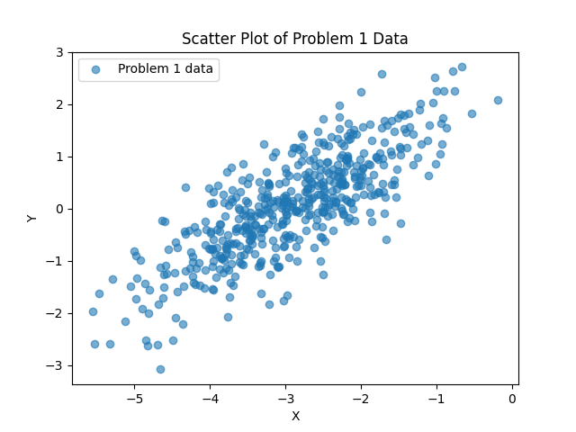
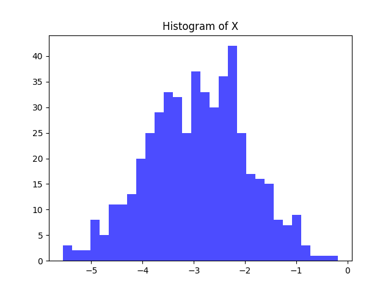
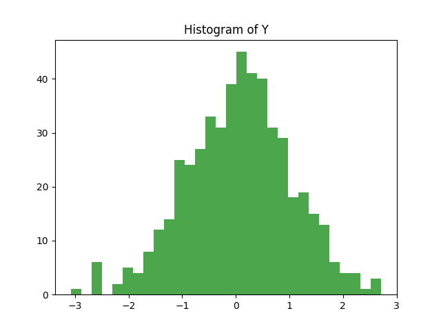
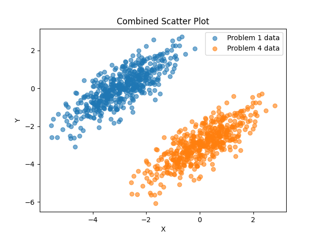

# Dummy Data Assignment

---

### **Purpose**
- Practice with NumPy (numerical Python library).
- Learn how to visualize data with scatter plots and histograms.
- Prepare datasets in a form commonly used for machine learning.

---

### **Problem Description**
- In machine learning experiments, we often need **dummy data** (synthetic data).  
- Here, we generate random numbers from **multivariate normal distributions** and visualize them.  
- Finally, we combine and label the datasets to create a structure similar to real-world ML datasets.

---

## Assignments

### **[Problem 1] Creating Random Numbers**
- Generate 500 random points from a 2D normal distribution.  
- Mean = (-3, 0), Covariance =  
  ```math
  \begin{bmatrix}
  1.0 & 0.8 \\
  0.8 & 1.0
  \end{bmatrix}
  ```
- Fix seed = 0.  
**Output:** Shape = (500, 2).

---

### **[Problem 2] Scatter Plot Visualization**
- Visualize Problem 1 data using `plt.scatter()`.  
- Save as:  
  

---

### **[Problem 3] Histogram Visualization**
- Plot histograms for each dimension separately using `plt.hist()`.  
- Align x-axis with `plt.xlim()`.  
- Save as:  
  -   
  - 

---

### **[Problem 4] Addition of New Data**
- Generate another 500 random points with mean = (0, -3).  
- Same covariance as Problem 1.  
- Plot both datasets in one scatter with legend (0 = old data, 1 = new data).  
- Save as:  
  

---

### **[Problem 5] Data Combination**
- Combine datasets from Problem 1 and 4.  
- Shape of result = (1000, 2).  
**Output:** Printed combined array shape.

---

### **[Problem 6] Labeling**
- Add labels:  
  - 0 = Problem 1 data  
  - 1 = Problem 4 data  
- Final shape = (1000, 3).  
- Save as CSV: [labeled_data.csv](data/labeled_data.csv)

---

### **Tools Used**
- Python  
- NumPy  
- Matplotlib  
- Pandas (for CSV export)

---

### **How to Run**
1. Clone the repository or download the files.
2. Navigate into the project directory.
3. Run each problem script with Python:
   ```bash
   python problem1/generate_data.py
   python problem2/scatter_plot.py
   python problem3/histogram.py
   python problem4/combined_scatter.py
   python problem5/combine_data.py
   python problem6/label_data.py
   ```

---

## Author
**Assignment:** Dummy Data Assignment  
**Name:** Victor Karisa  
**Date:** 25/09/2025
